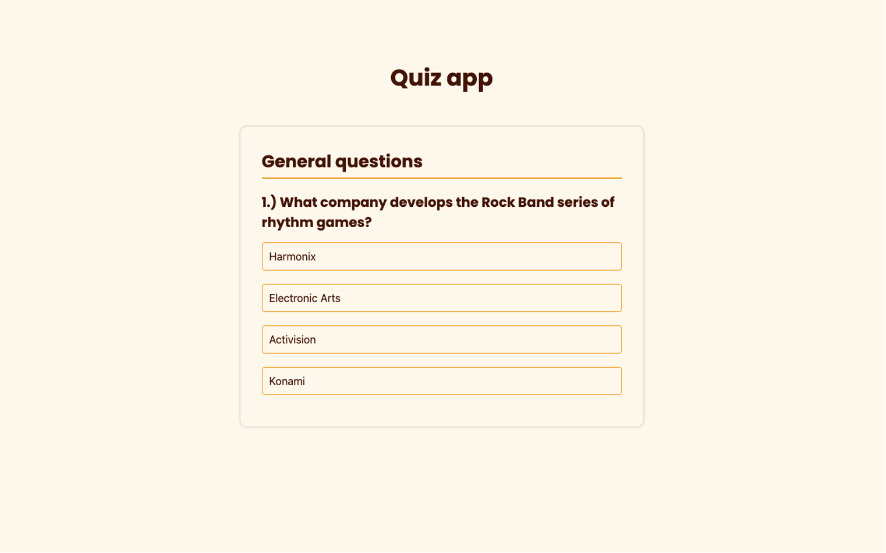

# Quiz app

## A simple quiz component about various topics.

This project uses the [Open Trivia DataBase](https://opentdb.com/)'s API to get all the questions and answers. In this case, only ten questions and four answers for each are displayed to the user, but that can be updated easily only by changing some parameters when fetching the data.

Initially, all questions and answers were loaded directly into the main.js. However, that wasn't the most maintainable option since I had to write all questions/answers manually. So, I sorted it out by putting the API in the project.

I had trouble getting the data because I was fetching it every time I needed it for various processes that needed it in a specific step; I ended up with many issues during the execution. So, I overcame it by storing all data in an empty array before starting any other process. That way, the fetch process occurs at the beginning (while the loader is still on screen), so all other processes that rely on that data can execute without significant issues.

Another situation was that answers were loaded in the same order, which is not funny because the correct answer was always the last one presented. So, after a bit of searching, I got a 'mini-algorithm' that could fix issue by shuffling the answers before they were displayed.

Last but not least, [click here](https://gregorim04.github.io/quiz-app) to see the live page. :)
